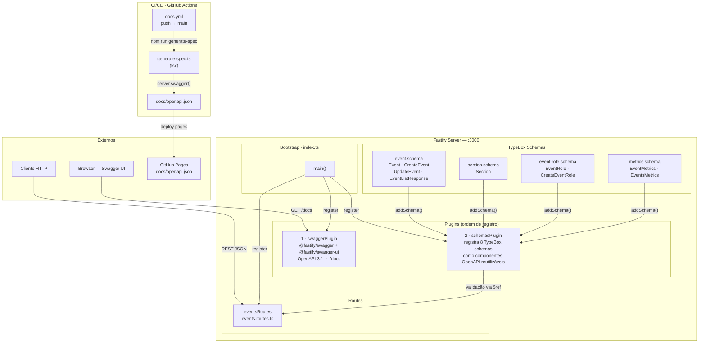
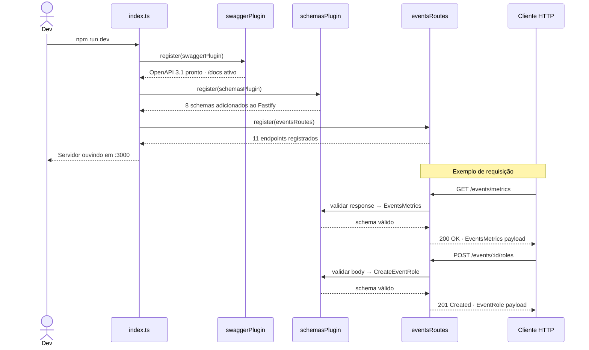
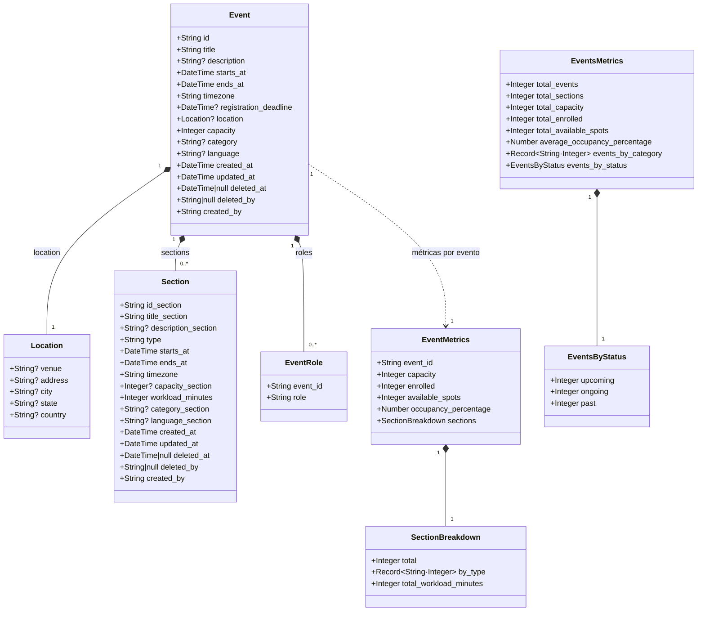
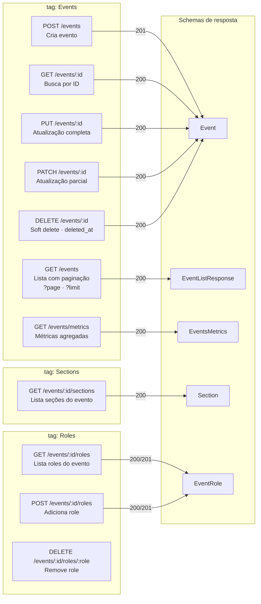
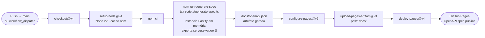

# Events API

API REST para gerenciamento de eventos, seções e matrículas, construída com **Fastify 5** e **TypeBox**.

## Stack

| Camada | Tecnologia |
|---|---|
| Framework | Fastify 5 |
| Schemas / Validação | @sinclair/typebox 0.34 |
| Documentação | @fastify/swagger + @fastify/swagger-ui |
| Linguagem | TypeScript 5 |
| Testes | Vitest 2 |
| Runtime dev | tsx |

## Scripts

```bash
npm run dev            # servidor com hot-reload
npm run build          # compila TypeScript → dist/
npm run start          # executa build compilado
npm run test           # roda testes com Vitest
npm run generate-spec  # gera docs/openapi.json
```

A documentação interativa fica disponível em `http://localhost:3000/docs` após iniciar o servidor.

---

## Arquitetura

### Componentes do Sistema



---

### Fluxo de Inicialização e Ciclo de Requisição



---

### Modelo de Dados



---

### Endpoints da API



---

### Pipeline CI/CD


